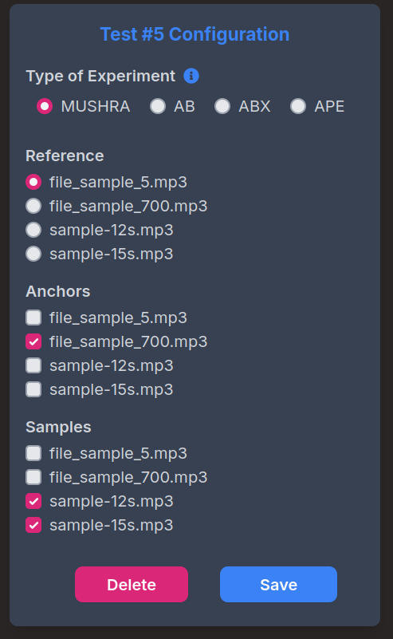
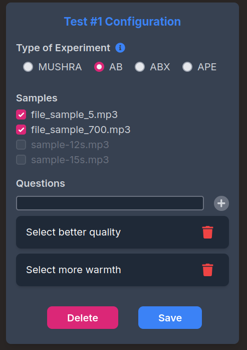
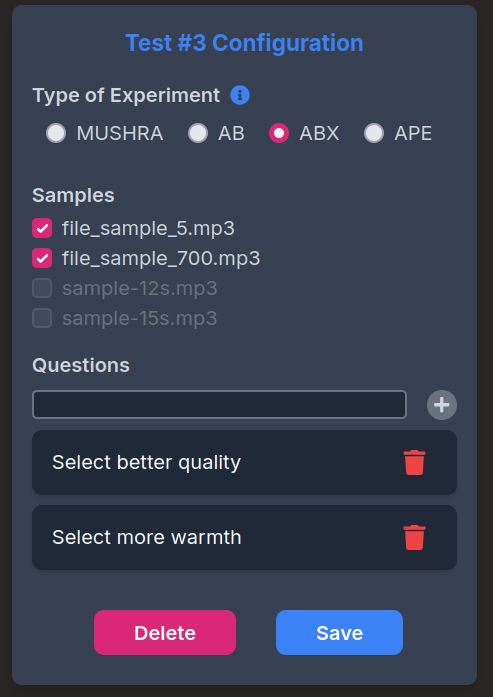
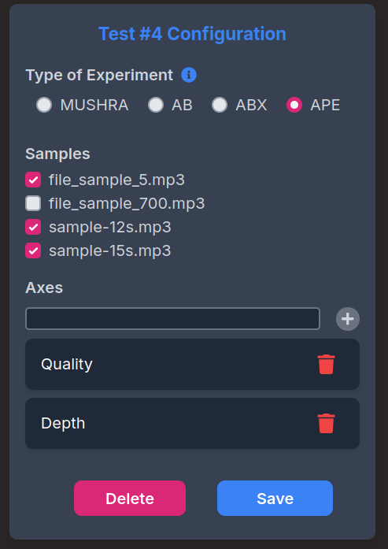

# Test types overview

## **MUSHRA Test**
**MUSHRA** (Multiple Stimuli with Hidden Reference and Anchor) is a standardized method for evaluating audio quality. Participants compare multiple versions of the same audio signal, including a hidden reference and one or more distorted variants. Each sample is rated on a perceptual quality scale from 0 to 100. Users can freely switch between tracks and replay them as needed.

## **AB Test**
The **AB test** presents participants with two audio tracks and asks them to choose between them. It is commonly used for binary comparisons, such as “Which track sounds better?” or “Which has clearer spatial definition?”

## **ABX Test**
In an **ABX test**, participants are given two known reference tracks (A and B) and a third track (X), which is randomly identical to either A or B. The task is to identify whether X matches A or B, focusing on subtle perceptual differences.

## **APE Test**
The **APE test** (Audio Perceptual Evaluation) allows participants to assess audio samples using continuous rating scales. It supports evaluation of specific perceptual dimensions such as intelligibility, naturalness, and overall quality, typically using sliders.

